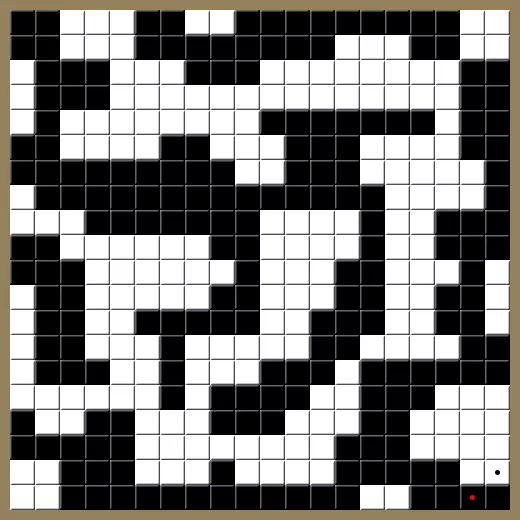
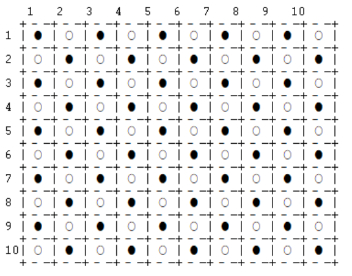
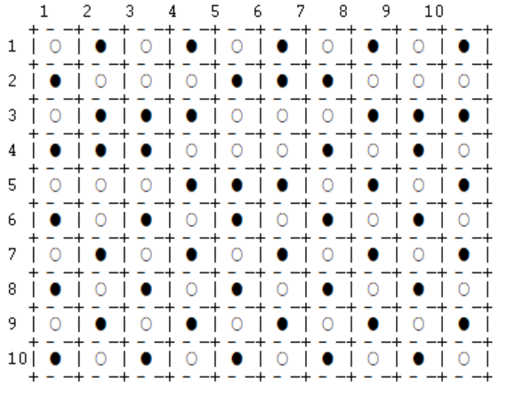
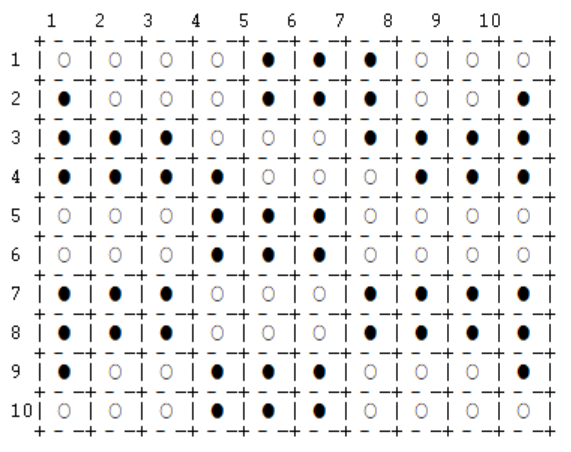

# TP1 PLOG - Emulsion

## Turma 3 Grupo Emulsion_3

| Nome                                     | Número de estudante    | E-Mail             |
| ---------------------------------------- | --------- | ------------------ |
| Inês Oliveira e Silva                                | 201806385 |up201806385@fe.up.pt|
| Luís Miguel Maia Marques Torres E Silva              | 201808912 |up201808912@fe.up.pt|

---

## Instalação e Execução
 Colocar todos os ficheiros com extenção '.pl' na mesma pasta
* Iniciar o Sicstus Prolog (ou outro ambiente de desenvolvimento Prolog compativel com Sicstus e com o standard ISO)
* Consultar/importar o ficheiro 'emulsion.pl' <consult('path/to/file/emulsion.pl')>
* Chamar a funcao play/0 escrevendo o comando 'play.'

O Jogo Emulsion
======

Emulsion é um jogo de tabuleiro para 2 jogadores. Foi inventado em 2020
por Luis Bolaños Mures, um inventor de jogos, conhecido por algumas
variantes do jogo Go e 3D Amazons. À semelhança do xadrez e das damas
cada jogador tem peças de uma das cores (pretas ou brancas) e é jogado
num tabuleiro quadrado cuja dimensão máxima não está definida. O tempo
de jogo normalmente situa-se entre os 20 e os 60 minutos.

Preparação/Estado Inicial
-------------------------

Inicialmente o tabuleiro encontra-se povoado de peças num padrão
axadrezado, ou seja, em todos os quadrados existe uma peça, e as peças
de quadrados ortogonalmente adjacentes têm cor diferente. Caso o
tabuleiro possua dimensão ímpar, isto é, possua um número de espaços
ímpar, a peça central do tabuleiro é ocupada por uma peça de cor branca.

O jogador com as peças pretas inicia o jogo.

Objetivo
--------

Cada peça tem um valor final atribuído dependente do número de peças da
mesma cor que lhe são adjacentes ortogonalmente a que se soma metade do
número de lados (limites) do tabuleiro que lhe são adjacentes.

Um grupo de peças é um conjunto de peças ortogonalmente adjacentes. O tamanho de um grupo é o número de peças da mesma cor ortogonalmente adjacentes entre si. 

O objetivo final é obter o maior grupo de peças possível e em caso de
empate comparam-se os grupos de de tamanhos consecutivamente menores. Caso o
empate se mantenha, o tamanho do tabuleiro seja par e se verifiquem
empates em todos os grupos de peça, o vencedor é o jogador que fez o
último movimento.

Jogadas Possíveis
-----------------

A cada jogada o jogador pode trocar quaisquer duas peças ortogonal or
diagonalmente adjacentes desde que estas sejam de cores diferentes e que o valor da sua peça aumente.

Fim de Jogo
-----------

O jogo termina assim que não hajam mais jogadas possíveis.

Lógica do Jogo
================
O início do programa começa ao invocar o predicado **play/0**, no qual é apresentado o menu inicial chamando **initialMenu/0** . 

De acordo com o modo de jogo e tamanho de tabuleiro escolhido pelo utilizador, é preenchido o estado inicial do jogo e chamado o predicado **display_game/2** para iniciar a primeira jogada. É impresso na consola o tabuleiro e verificadas as jogadas possíveis, tomando partido de **valid_moves/3**, e chamando de seguida **checkEnd/3**. Este predicado termina o jogo se já não houver jogadas possíveis ou chama **playerTurn/4**, para que o jogador escolha a peça que pretende mover e a nova posição desta peça, de entre as apresentadas. Depois da jogada ser efetuada, é de novo chamado o predicado **display_game/2**, iniciando agora a jogada do próximo jogador. Quando este ciclo é interrompido pela impossibilidade de mover peças, em **checkEnd/3**, é apresentado o vencedor e retorna-se ao menu inicial.

Representação do estado do Jogo
===============================
O estado do jogo atual é guardado na variável **GameState**, numa lista de listas. A lista representa o tabuleiro, e as listas contidas nesta representam as diferentes linhas do tabuleiro. As linhas do tabuleiro contêm átomos "black" ou "white" representando uma peça preta ou branca em cada posição. Esta estrutura é preenchida no início do jogo conforme o tamanho introduzido pelo utilizador, usando o predicado **fillBoard/2**.

O jogador atual é guardado na variável **Player**. Esta variável é composta pelos valores **Color-Mode-Switch-Ai1-Ai2**, indicando respetivamente a cor do jogador, o modo de jogo ('player' ou 'computer'), se o jogador seguinte está a jogar no mesmo modo (0 se o modo de jogo não troca, 1 se troca), o nível de inteligência do jogador 1, e o nível de inteligência do jogador 2, se forem computadores.

De seguida apresentam-se exemplos da representação de estados de jogo inicial, intermédio e final.

Situação Inicial
----------------

initialBoard([
[black,white,black,white,black,white,black,white,black,white],
[white,black,white,black,white,black,white,black,white,black],
[black,white,black,white,black,white,black,white,black,white],
[white,black,white,black,white,black,white,black,white,black],
[black,white,black,white,black,white,black,white,black,white],
[white,black,white,black,white,black,white,black,white,black],
[black,white,black,white,black,white,black,white,black,white],
[white,black,white,black,white,black,white,black,white,black],
[black,white,black,white,black,white,black,white,black,white],
[white,black,white,black,white,black,white,black,white,black]
]).

Situação Intermédia
-------------------

midBoard([
[white,black,white,black,white,black,white,black,white,black],
[black,white,white,white,black,black,black,white,white,white],
[white,black,black,black,white,white,white,black,black,black],
[black,black,black,white,white,white,black,white,black,white],
[white,white,white,black,black,black,white,black,white,black],
[black,white,black,white,black,white,black,white,black,white],
[white,black,white,black,white,black,white,black,white,black],
[black,white,black,white,black,white,black,white,black,white],
[white,black,white,black,white,black,white,black,white,black],
[black,white,black,white,black,white,black,white,black,white]
]).

Situação Final
--------------

finalBoard([
[white,white,white,white,black,black,black,white,white,white],
[black,white,white,white,black,black,black,white,white,black],
[black,black,black,white,white,white,black,black,black,black],
[black,black,black,black,white,white,white,black,black,black],
[white,white,white,black,black,black,white,white,white,white],
[white,white,white,black,black,black,white,white,white,white],
[black,black,black,white,white,white,black,black,black,black],
[black,black,black,white,white,white,black,black,black,black],
[black,white,white,black,black,black,white,white,white,black],
[white,white,white,black,black,black,white,white,white,white]
]).

Visualização do Estado do Jogo
===============================
No início da execução do programa, é chamado o predicado **initialMenu/0**, apresentando um menu para o utilizador decidir se irão jogar 2 jogadores, 1 jogador contra o computador ou irá jogar o computador contra si próprio. É chamado de seguida o predicado **startGame/1**, que consoante o valor do argumento que recebe (indicando a opção selecionada pelo utilizador), inicia o jogo com a informação adequada.  No caso de pelo menos um dos jogadores ser virtual, é pedido ao utilizador que indique qual o nível de "inteligência" do(s) computador(es). Além disso é perguntado ao jogador qual será o tamanho do tabuleiro que pretende utilizar (sendo que este número deverá estar no intervalo 1-11).
Todos os dados introduzidos pelo utilizador são verificados e se necessário é pedido que o utilizador os reintroduza.

O predicado de visualização do estado de jogo, **printBoard/2**, recebe como argumentos uma lista de listas representando o tabuleiro e um inteiro representando o número da próxima linha a imprimir (inicialmente, 0, indicando o cabeçalho do tabuleiro que contém a numeração das colunas). Este predicado imprime uma linha de cada vez chamando **printLine/1**, que imprime uma peça do jogo de cada vez usando **printCell/1**. Para tal, este último predicado invoca **code/2** que a cada átomo representativo das peças (“black” ou “white”) atribui um caracter unicode para a correta representação na consola.

Lista de Jogadas Válidas
===============================
Para determinar as jogadas válidas para um jogador num dado momento foi implementado o predicado **valid_moves(+GameState, +Player, -ListOfMoves)**.  Este predicado recorre a **findPieces/4** para encontrar todas as peças do jogador Player, percorrendo *GameState* e devolvendo uma lista com as posições das suas peças, que é depois passada a **findMoves/3**, para encontrar todos os movimentos possíveis para essas peças. Este predicado, para cada peça do jogador, procura todas as peças adjacentes (tanto ortogonal como diagonalmente) de cor diferente e determina se é possível executar a troca entre estas, juntando esse movimento à lista de movimentos válidos em caso positivo. A validade de um movimento é verificada através do predicado **checkMove/4**, que simula a troca entre duas peças para averiguar se o valor da peça considerada aumenta. Cada elemento desta lista tem a estrutura *Pos-NewPos-Val*, representando respetivamente as posições iniciais e finais (no formato *[linha, coluna]*) e o incremento de valor da peça conseguido com o respetivo movimento. Este predicado nunca falha, retornando uma lista vazia na ausência de movimentos possíveis.

Execução de Jogadas
===============================
Antes de cada jogada, é construído um átomo **Move** a partir dos dados que o utilizador introduz. É verificado se as coordenadas introduzidas pelo utilizador pertencem ao conjunto de movimentos possíveis previamente identificados, senão são requeridas novas coordenadas. Este átomo tem a estrutura *OldPos-NewPos*, em que as coordenadas iniciais e finais estão no formato *[linha,coluna]*.
Para a execução de uma jogada é invocado o predicado **move(+GameState, +Move, -NewGameState)**. Este toma partido de **switchPieces/3**, que por sua vez invoca **switchColor/3** para as posições inicial e final recebidas no argumento *Move*, trocando portanto, a cor das peças e devolvendo, assim, o novo estado de jogo.

Final do Jogo
===============================
A cada jogada é invocado o predicado **checkEnd/3** que verifica se o jogo terminou (ou seja se o jogador seguinte não tem jogadas possíveis). Nesse caso, chama **game_over(+GameState, -Winner)**, que utiliza **value/3** para preencher uma lista com os tamanhos dos grupos de peças de cada jogador e invoca **getWinner/3** para determinar o vencedor a partir das mesmas listas.
Este predicado compara o tamanho do maior grupo de cada jogador e devolve na variável *Winner* a cor do que tiver conseguido criar o maior grupo. No caso de empate é comparado o segundo maior grupo e por aí adiante até ser conseguido o desempate. Como em tabuleiros com tamanho par pode ocorrer um empate completo, nessa situação é atribuído à variável *Winner* o valor 'both', e em **checkEnd/3** é assumido como vencedor o jogador que efetuou o último movimento.

Avaliação do Tabuleiro
===============================
A avaliação do estado do jogo é feita através de dois predicados, uma vez que durante o jogo é apenas necessário avaliar o valor de cada peça individualmente, sendo que apenas para determinar o vencedor é preciso avaliar o tabuleiro por inteiro. 
Para avaliar o valor de cada peça foi criado o predicado **valuePiece(+GameState, +Pos, -Value)**. Para determinar *Value* são verificadas as peças ortogonalmente adjacentes à peça contida em *Pos*, somando 1 ponto a *Value* por cada peça adjacente da mesma cor e 0.5 pontos por cada parede adjacente.
Para determinar o valor final do tabuleiro, o predicado **value(+GameState, +Player, -Value)** preenche *Value* com uma lista contendo, por ordem decrescente, os tamanhos dos grupos do jogador *Player*. Tal é conseguido invocando **countGroupSizes/3**, que por sua vez constroi uma lista com todas as posições das peças do jogador passado como argumento, usando **findPieces/4** e encontra os grupos chamando **findGroups/3**. Este predicado começa por calcular o tamanho do grupo em que se insere a primeira peça da lista de peças que recebe, tirando todas as peças desse grupo da lista de peças não exploradas e adicionando o tamanho do grupo à lista que será o resultado, chamando-se recursivamente até todas as peças terem sido exploradas. 

Jogada do Computador
===============================
O predicado choose_move(+GameState, +Player, +Level, -Move) recebe o estado atual do jogo, qual o jogador que efetuará a jogada (peças brancas ou peças pretas) e qual o nível de *inteligência*, ou seja, qual a estratégia a utilizar. Calcula as jogadas possíveis de realizar para o jogador e depois de aplica a estratégia definida para determinar quais as peças a mover, retornando-as na variável *Move* que tem o formato *[coordenadas iniciais]-[coordenadas finais]*.

Estratégia randomizada
----------------------
O predicado **getRandomPlay/2** faz uso da biblioteca *random* para determinar um número aleatório no intervalo [1-número de jogadas possíveis], selecionando desta forma qual a jogada a executar de entre as possíveis.

Estratégia gananciosa
---------------------
O predicado *findHighestVal/2* percorre a lista de jogadas possíveis determinando qual delas permite que a peça movida tenha o maior aumento de valor. Retorna o movimento que provoca o maior aumento do valor de uma peça.

Conclusões
============

O objetivo deste trabalho foi a implementação do jogo Emulsion na linguagem Prolog recorrento ao sistema de desenvolvimento Sicstus. Existia um objetivo secundário de implementação de um jogador virtual. Ambos foram concluídos com sucesso tendo existindo ainda o cuidado de simplificar interface do utilizador.

Uma possivel melhoria futura seria a tentativa de implementar um algoritmo de inteligência artificial que levasse em conta os movimentos adversários das rondas subsequentes.

Foi identificado um problema de compatibilidade quando o programa é executado no emulador 'wine', podendo existir erros de impressão de caracteres unicode devido a definições erradas de linguagem/dicionário no emulador 'wine'.

Bibliografia
============

[Mais informações sobre o jogo emulsion](https://boardgamegeek.com/boardgame/311851/emulsion)

[Mais informações sobre o autor](https://boardgamegeek.com/boardgamedesigner/47001/luis-bolanos-mures)

[Informações sobre a biblioteca random do Sicstus](https://sicstus.sics.se/sicstus/docs/3.7.1/html/sicstus_23.html)

[Informações sobre a biblioteca system do Sicstus](https://sicstus.sics.se/sicstus/docs/3.7.1/html/sicstus_24.html)

[Infrmação sobre impressão de caracteres ascii e Unicode no Sicstus](https://sicstus.sics.se/sicstus/docs/4.5.1/html/sicstus/ref_002dsyn_002dsyn_002dtok.html)

[Informação sobre escape sequences no Sicstus](https://sicstus.sics.se/sicstus/docs/3.12.9/html/sicstus/Escape-Sequences.html)
